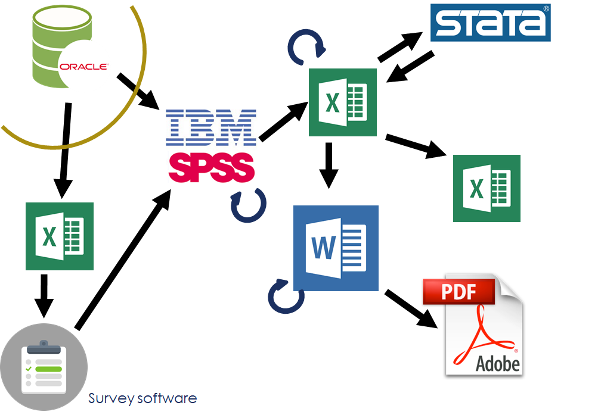
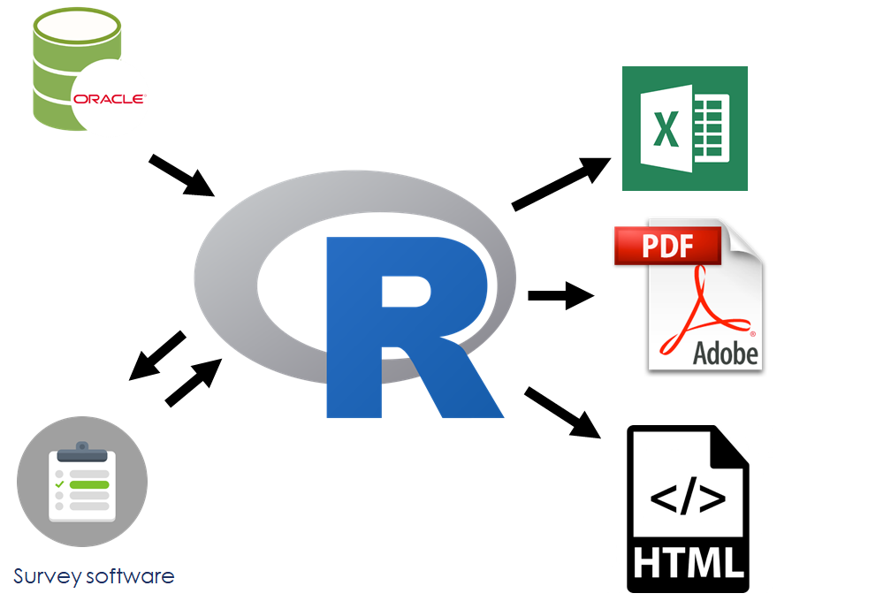

# Same name, different bird

What do we mean when we see a bird and say that it's a robin? A simple description would be a small brownish bird with a red breast. But that's a superficial description, and when we say "robin" what we mean depends on your location; you don't have to look very closely to see that the European and American robins are fundamentally different. The European robin (_Erithacus rubecula_) is an Old World flycatcher, catching insects on the wing. 

(_Source: Wikipedia_)

The American robin (_Turdus migratorius_) is a thrush, and eats earthworms and other invertebrates, along with fruits and berries.

(_Source: Wikipedia_)

(The naming of the American robin is a classic case of ["The Captain's Hat"](https://www.youtube.com/watch?v=dOBhf8f7cXM); European explorers and colonists arriving in other parts of the world and naming things in a way that isn't necessarily accurate.)

***

Similarly, what do we mean when we say "data scientist"? 

Here's a tweet by JD Long:
<blockquote class="twitter-tweet" data-lang="en">
Why does data science exist as “a thing”? I postulate: the transaction costs of getting stats, biz, &amp; dev people working together outweigh the gains from specialization. This has been wildly misunderstood by management consultants who fetishize gains from specialization.
&mdash; JD Long (@CMastication) <a href="https://twitter.com/CMastication/status/1126457956269285376?ref_src=twsrc%5Etfw">May 9, 2019</a></blockquote>

The second tweet in his thread was the one that caught my attention:
<blockquote class="twitter-tweet" data-lang="en">
Data Science got initial traction inside of small firms &amp; startups that needed fast iteration &amp; could not support specialists in data, stats, hacking &amp; biz. They grew up this hybrid that combines domains and doesn’t specialize. In large orgs there becomes friction w specialists.
&mdash; JD Long (@CMastication) <a href="https://twitter.com/CMastication/status/1126458904060276736?ref_src=twsrc%5Etfw">May 9, 2019</a></blockquote>

Eric Colson's paper at HBR (2019-03-08), [Why Data Science Teams Need Generalists, Not Specialists](https://hbr.org/2019/03/why-data-science-teams-need-generalists-not-specialists), provides a compelling argument the generalist data scientist provides significant value to the organization, particularly small organizations.

Explicit in both Long and Colson's statements is that there are two different types of data scientists: the generalist and the specialist.

I want to go further in refining this typology, and postulate (based on my own anecdotal observations) some of the differences between the two.

### Generalists

Generalists can be found, as JD Long has noted, in smaller organizations. 

The academic backgrounds of data scientists tend to be [Statistics](https://sharla.party/) (as a discipline), or they are people with a quantitative bent from (for want of a better term) subject matter disciplines, such as [Astronomy](https://juliasilge.com/resume/), [Economics](https://medium.com/@metjush/4-reasons-why-economists-make-great-data-scientists-and-why-no-one-tells-them-524478845ec2), [Geography](http://personal.tcu.edu/kylewalker/projects.html), and [Psychology](https://psyr.org/).

This tends to position them smack dab in the middle of [Drew Conway's famous Venn diagram](http://drewconway.com/zia/2013/3/26/the-data-science-venn-diagram):

They bring subject matter expertise, foundational statistical knowledge, and some pragmatic programming skills.

The work of the generalist tends to follow the full sequence of a typical data science project as envisioned by Grolemund and Wickham in [_R for Data Science_](https://r4ds.had.co.nz/index.html):

    
I would go further, and argue that data scientists can (and perhaps should!) be involved earlier in the process, providing insights and expertise to the framing of the research question and the data collection phase.

And following this line of thinking, I have observed that generalist data scientists tend to favour R as their tool of choice. Roger Peng (a biostatistician) has said "The R programming language has become the de facto programming language for data science." R was developed first as a programming environment in which to do statistics, so many of the defaults and behaviours are optimized around how statisticians and subject-matter practitioners tend to think about their data analysis problem.

R's foundational data structures are mathematical and statistical in nature: vectors, matricies, and data frames. As well, base R has a plethora of statistical functionality built in--for example, t tests, regression models, and statistical distributions.

Those foundational elements include sampling >> [Not So Standard Deviations 81](http://nssdeviations.com/81-getting-to-yes-with-data-analysis), starting at 25:00

> Whenever I bring up the topic of sampling, minds are blown...the data science mindset is kind of like looking at the problems from two different angles...

### Specialists

The specialist data scientist is a different creature. They tend to have a degree in Computer Science or Computational Statistics, often at the graduate level. In Drew Conway's Venn diagram, they tend to be very deep on the "hacking skills", with less emphasis on the statistics (as a discipline) or subject matter expertise.

Their work seems to fall largely on the "modeling" part of the data science process. They work with tidy, pre-processed data, often as part of an automated data processing flow from collection through analysis and modeling, to communication (which might also included automated feedback to points earlier in the process).

Because of their computer science backgrounds, these data scientists, in general, favour Python as their programming environment of choice. Python is a programming language first, to which data analytics packages (such as the [{pandas} data analysis package](https://pandas.pydata.org/)) has been added. 

Not sampling but big data

### The view from a small organization

I work in a small data analytics organization, and lead a crack team of data scientists. Like myself, they fit the "generalist" typology--although computer science courses have been part of our training, we don't hold degrees in that area.

An example of our workflow can be shown in the example of an employee survey. Our process used to look like this:

    
[_source: Andy Teucher and Stephanie Hazlitt_](https://github.com/bcgov/bcgov-rstats-public-presentations/tree/master/2018-11-05_UBC_GEM580)

Data was extracted from the human resources database; we relied on database administrators from outside our organization to do this for us. This formed the survey frame, which was used in our survey software to administer the survey; the survey data then flowed into SPSS, where it was joined with demographic values from the HR database. Manipulation and modelling occured in three programs: SPSS, Excel, and Stata. 

The reporting to the clients was in the form of summary tables in Excel, along with PDF and HTML versions of documents written in Word. Note that programmers outside the organization were responsible for automating the production of these outputs, which have consistent structure and vary only by department.

Now it looks like this:

The data scientists in our organization can write (in R) code that pulls the extract from the database which is used for the survey frame. They deploy the survey to collect the data, and then use R to wrangle and model the survey data--work that was done in a variety of other tools. The data scientists have also written R code (using the [{xlsx} package](https://github.com/colearendt/xlsx)), and creates a variety of outputs including Excel, PDF, and (coming soon) web-based reports (using [Shiny](https://shiny.rstudio.com/)).

### Growing data science in a small data-centric organization

The challenge:

* growing generalist data science practice. 

My experience: some are "Super User" (find Dr Aimee Gott's slides)

* self-directed learning based on problem-solving mindset, often driven by inate urge to find efficiencies

Need to empower them, find Super Users in Training

_ELABORATE_

### Plugging data science into a large data-centric organization

Two challenges: 

* growing generalist data science practice in the specialist areas.

* fitting the specialists into an existing workflow

_ELABORATE_

### It's not just the people

Key point: data scientists of both stripes need a robust tech platform. Not rejecting IT, but need something different than app development

(similarity to dev ops -- tweet in JD Long's thread)

### Leadership

Leaders of data scientists need to be able to empower their teams

A significant part of that leadership is being the person to [work through and around the Giant Hairball, and help the team overcome the gravity of the Hairball](https://github.com/bcgov/bcgov-rstats-public-presentations/blob/master/2018-11-07_EARL_Seattle/Overcoming_gravity.md)

### A biased view

Of course, there is significant bias in the Euro- and North American-centric definition of what defines a "robin". In the same way that there is a [Japanese robin](https://en.wikipedia.org/wiki/Japanese_robin) and a [Siberian blue robin](https://en.wikipedia.org/wiki/Siberian_blue_robin) (below), my view of what defines a "data scientist" might also be too narrow.

(_Source: Wikipedia_)

## Notes

[PDF](robins_notes.pdf) 
