Beginning to understand tidyeval

## Hadley Wickham's _Tidy evaluation in 5 minutes_

A [short video on YouTube](https://www.youtube.com/watch?v=nERXS3ssntw), converted to text, script, and annotations

# The 5 big ideas of tidy evaluation

## 1: R code is a tree

R code has a hierarchical structure which can be visualized


```{r}

f(x, "y", 1)


```

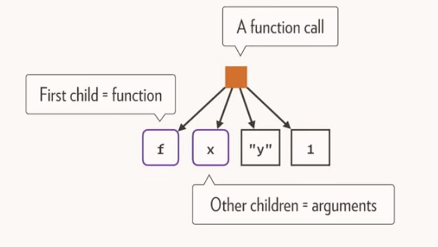

and this structure can have multiple levels


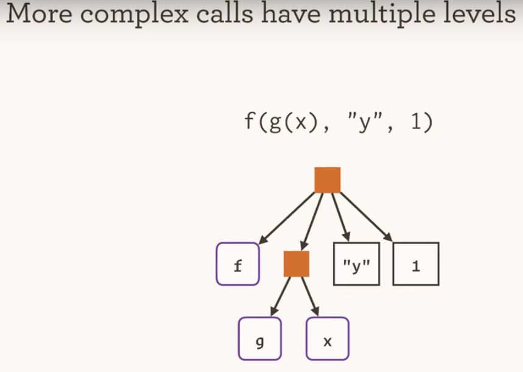


```{r}

f(g(x), "y", 1)

```

Every expression has a tree

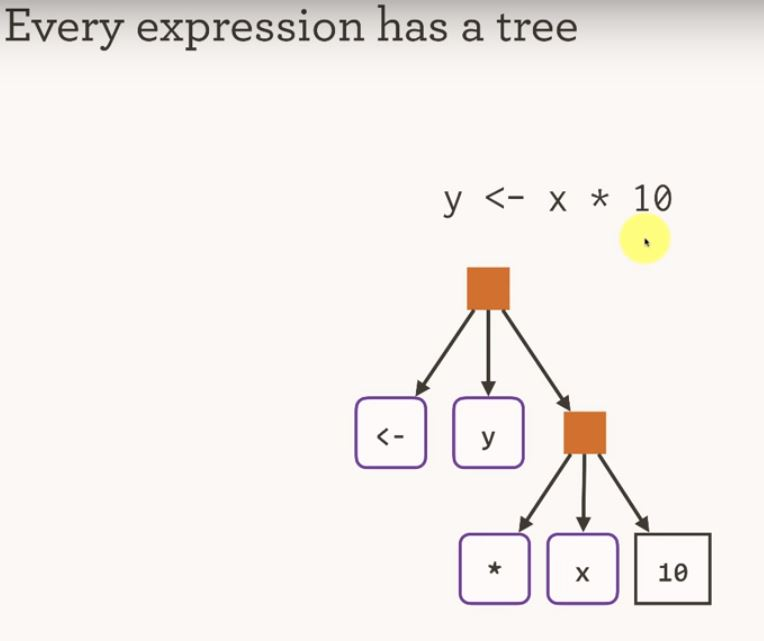

```{r}

y <- x * 10

`<-`(y, `*`(x, 10))

```


## 2: Capture the tree by quoting

> `rlang:expr()` and > `rlang:enexpr()`


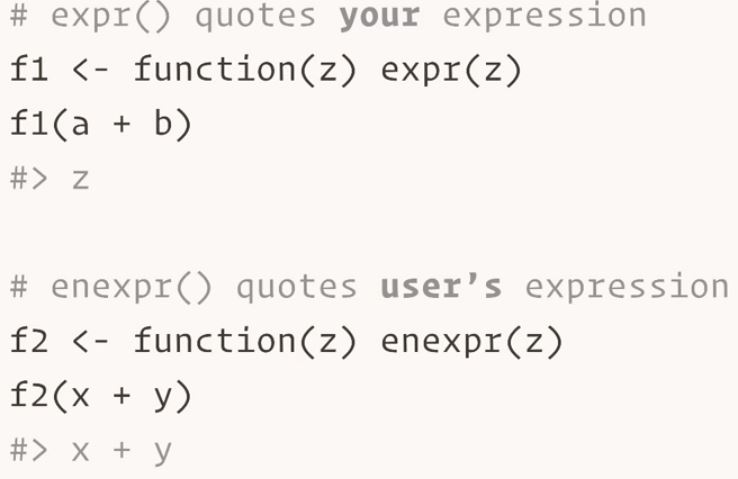

```{r}

library(rlang)

f1 <- function(z) expr(z)
f1(a + b)

f2 <- function(z) enexpr(z)
f2(x + y)

```


This leads to new vocabulary: 

Arguments can be **evaluated** or **quoted**


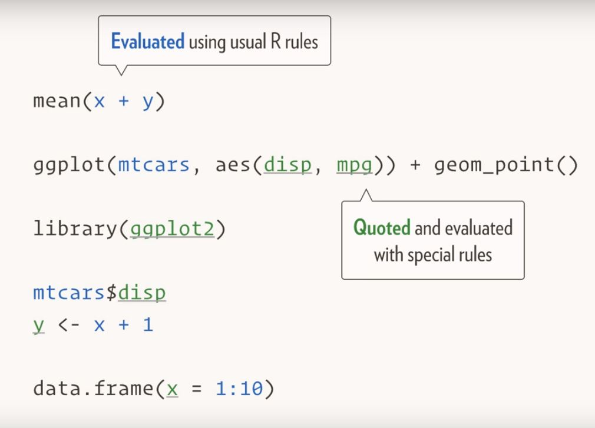


Which is used throughout the tidyverse

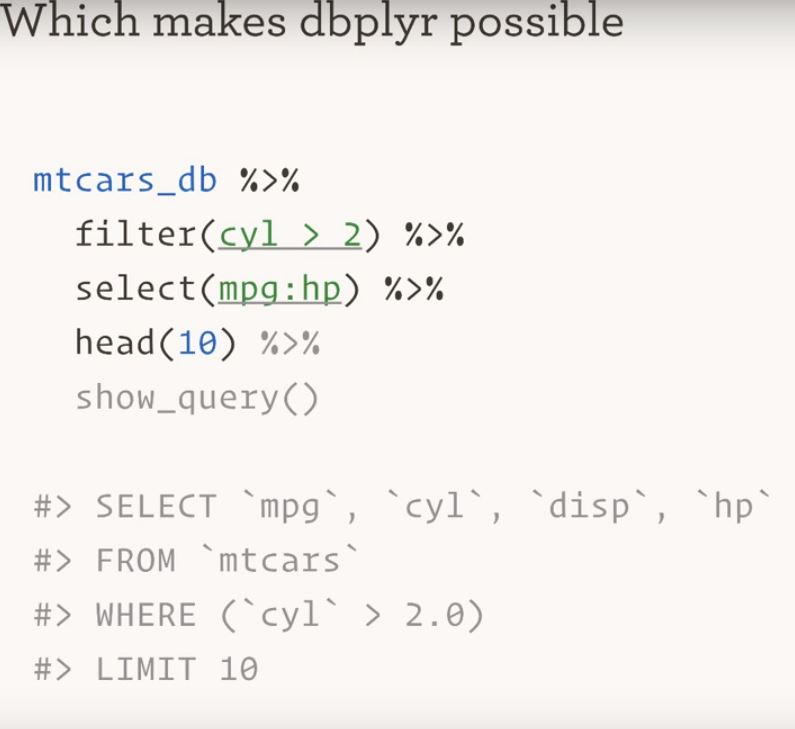


## 3: Unquoting makes it easy to build trees

"!!" unquotes (and is pronounced "bang-bang")

```{r}

(xy <- expr(x + y))

expr(!!xy + z)

expr(1 / !!xy)


```


A simple example:

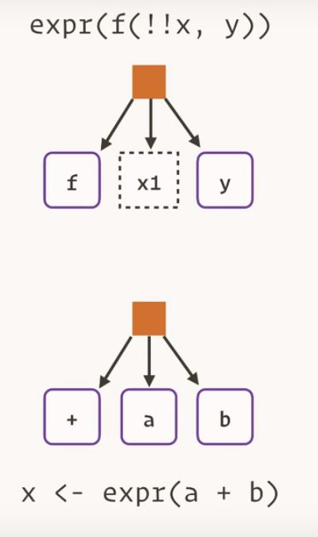


```{r}

x <- expr(a + b)

expr(f(!!x, y))

```


## 4: Quote / unquote

If you want to wrap a function that quotes one or more of its arguments you need to quote one or more of your arguments, and then unquote them


A simple example from `ggplot2`:

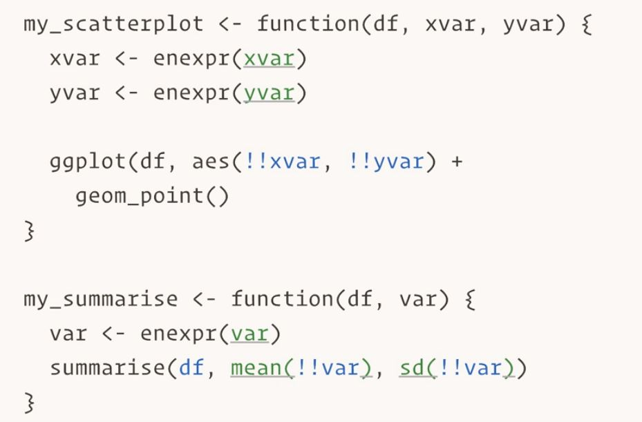


## NOTE: doesn't _quite_ work

Doesn't take into account the environment in which those expressions are evaluated

Important when variables from dataframe mingle with variables from environment

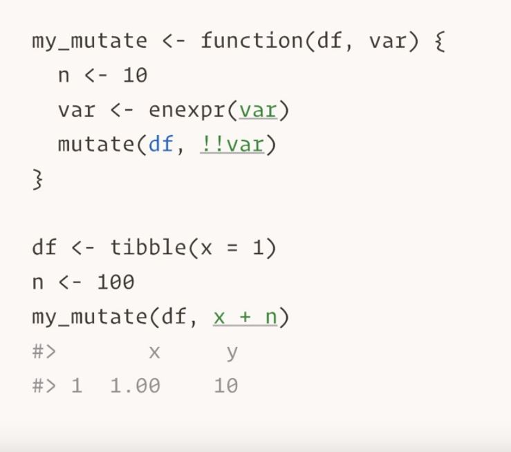


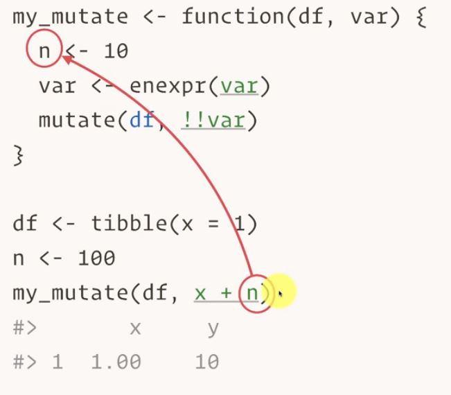


## 5: Quosures capture expression and environment

"Quosure" -- portmanteau of "quotation" and "closure"

Change expression from `enexpr` to `enquo`

* `enquo` uses n from global environment, not function

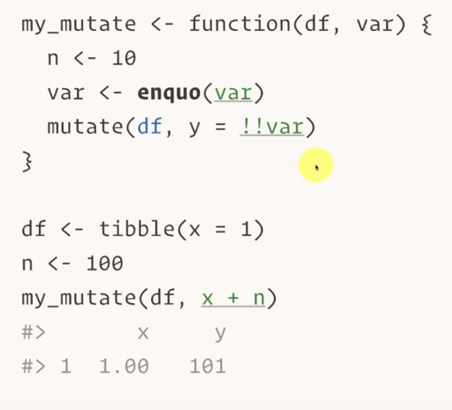


